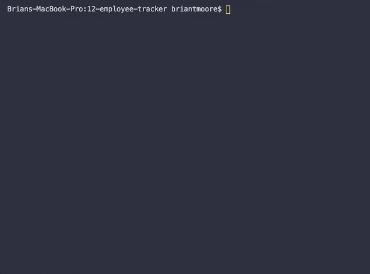

# 12-employee-tracker
## Unit 12 MySQL Homework: Employee Tracker

A [Node.js](https://nodejs.org/) command line interface CRUD application that interacts with a [MySQL](https://www.mysql.com/) database of employees at a company.

CLI interaction via [Inquirer.js](https://github.com/SBoudrias/Inquirer.js/), [Chalk](https://github.com/chalk/chalk), [console.table](https://github.com/bahmutov/console.table), and [console-clear](https://github.com/lukeed/console-clear).

